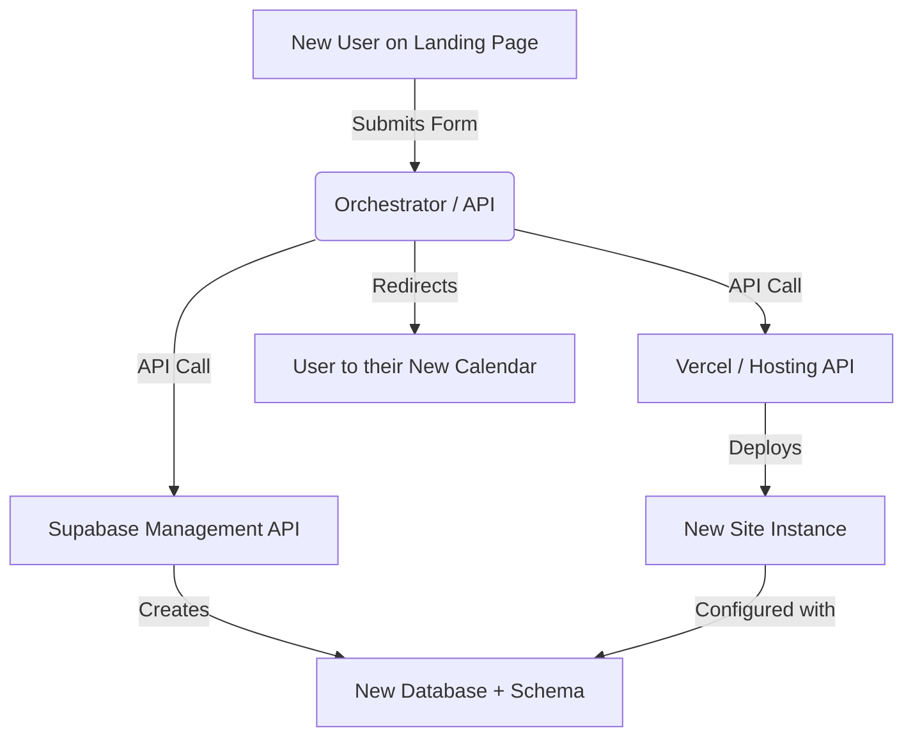

# Technical Feasibility: Automated MMC Calendar Deployment

This document outlines the effort and technical steps required to automate the creation of self-contained versions of the MMC Calendar for different groups.

## Overview

The MMC Calendar is built with a modern stack (**React + Vite + Supabase**) that is naturally well-suited for automation. Since configuration is driven by environment variables, the effort to "clone" the application for a new group is relatively low.

## Feasibility Assessment

### 1. Frontend Replication (Ease: High)
The application logic is decoupled from the data.
- **Approach**: The codebase can be treated as a template.
- **Action**: Creating a new version involves a fresh deployment of the existing code to a new URL (e.g., via Vercel or Netlify).
- **Configuration**: Any group-specific branding (title, logo, theme colors) can be moved to a `config.json` or additional environment variables to avoid code changes.

### 2. Backend Provisioning (Ease: Medium)
Each group would ideally have its own Supabase project to ensure data isolation.
- **Current state**: Database schema is documented in `database-schema.md`.
- **Automation logic**: 
    1. Create a new Supabase project (Manual or via Supabase CLI/API).
    2. Apply the SQL schema to create tables (`activities`, `tasks`, `categories`).
    3. Retrieve the new `SUPABASE_URL` and `ANON_KEY`.

### 3. Automation Tiers

| Tier | Description | Setup Time | Deployment Time |
| :--- | :--- | :--- | :--- |
| **Manual** | Clone repo + Manual Supabase setup + Manual Vercel push. | 0 mins | ~30-60 mins |
| **Semi-Auto** | GitHub Template Repo + Supabase CLI Script. | 2 hours | ~10 mins |
| **Full-Auto** | Custom "Provisioning Dashboard" that uses APIs to spin up both DB and Hosting. | 10-15 hours | ~2 mins |

## Proposed Strategy for "Self-Contained" Versions

To make this seamless, I recommend:
1.  **Template Repository**: Turn the current repo into a GitHub Template.
2.  **Environment Driven**: Ensure *everything* that changes between groups (Title, Timezone, Admin Emails) is in `.env` or a central `config` file.
3.  **Setup Script**: A PowerShell or Bash script that uses the Supabase CLI to "push" the schema to a new project automatically.

## Conclusion

Creating self-contained versions is **highly feasible**. The architecture is already clean. The "hardest" part is the one-time setup of an automation script for the database schema, but even that is a standard DevOps task.

## Automated Self-Provisioning (SaaS Flow)

Yes, you can absolutely build a "sign-up and spin-off" flow. This transforms the MMC Calendar into a multi-tenant SaaS application.

### Technical Architecture

1.  **Landing Page**: A simple form (Name, Org Name, Admin Email).
2.  **Orchestrator (Backend)**: A serverless function (e.g., Vercel Function) that triggers on form submission.
3.  **The "Spin-off" Logic**:
    -   **Step 1: DB Provisioning**: The Orchestrator calls the **Supabase Management API** to create a new project and runs the SQL script from `database-schema.md` to initialize it.
    -   **Step 2: Hosting Deployment**: The Orchestrator calls the **Vercel API** to create a new project, connected to your GitHub repo, but with the *new* Supabase credentials injected as environment variables.
    -   **Step 3: Completion**: The user is redirected to their new, unique URL (e.g., `https://org-name.mmc-calendar.com`).

### Workflow Diagram

### Effort Estimate
Building this "Orchestrator" and wiring it to the APIs would take approximately **10–15 hours** of development time to ensure error handling (e.g., what if a project name is taken?) and proper security.
